# mfrashad.com

Personal website of Rashad — builder, writer, diver. A living portfolio tracking projects, writing, books, movies, bookmarks, resources, and more. Built with Astro 5 and deployed on Vercel.

**Live site:** [mfrashad.com](https://www.mfrashad.com)

---

## Tech Stack

| Layer | Choice |
|-------|--------|
| Framework | [Astro 5](https://astro.build) — `output: 'server'` with ISR (60 s revalidation) |
| Adapter | `@astrojs/vercel` · Node.js 20 |
| UI components | React 18 islands (`@astrojs/react`) |
| Styling | Tailwind CSS 3.3.5 |
| Content | MDX (blog/notes), local JSON/TS data files, Astro content collections |
| Analytics | [PostHog](https://posthog.com) |
| Guestbook DB | [Turso](https://turso.tech) (libsql / `@libsql/client`) |
| Digital garden | [Cleve](https://cleve.ai) via Convex HTTP client |
| Bookmarks | [Raindrop.io](https://raindrop.io) API |
| Books | [Hardcover](https://hardcover.app) API |
| Movies | Letterboxd scrape (cached at build time) |
| Content studio | [Remotion](https://remotion.dev) 4 — carousel stills + video reels |
| Image pipeline | Playwright (screenshots) · sharp (resize) · node-html-parser (OG/favicons) |
| Fonts | apercu · Fira Mono · LiebeHeide · Fraunces |

---

## Quick Start

```bash
git clone git@github.com:mfrashad/personal-website.git
cd personal-website
npm install
cp .env.example .env   # fill in your keys (all optional — site degrades gracefully)
npm run dev            # http://localhost:4321
```

---

## Pages

| Route | What it is |
|-------|-----------|
| `/` | Home — animated hero, featured projects, latest writing |
| `/about` | Bio, skills tree, timeline |
| `/now` | What I'm working on right now |
| `/blog` | Writing — MDX posts + Cleve notes |
| `/blog/tags/[tag]` | Posts by tag |
| `/topics/[topic]` | Posts by topic (generated from frontmatter) |
| `/books` | Reading list via Hardcover |
| `/movies` | Letterboxd diary (cached at build) |
| `/bookmarks` | Raindrop.io collections |
| `/postcards` | Interactive guestbook (Turso) |
| `/resources` | Curated resource lists (29 categories) |
| `/resources/[category]` | Category detail with card grid |
| `/hobbies` | Hobbies overview |
| `/achievements` | Badges and milestones |
| `/diving` | Dive log |
| `/hackathons` | Hackathon history |
| `/hackathons/[slug]` | Individual hackathon detail |
| `/speaking` | Talks and panels |
| `/create` | Creative projects |
| `/media` | Brand kit / press |
| `/mentions` | Webmentions |
| `/colophon` | How the site is built |
| `/changelog` | Site update history |
| `/garden` → `/blog` | 301 redirect (legacy) |
| `/admin/*` | Local-dev only (disabled in prod) |

---

## Screenshots

<table>
<tr>
<td align="center"><a href="https://www.mfrashad.com/create">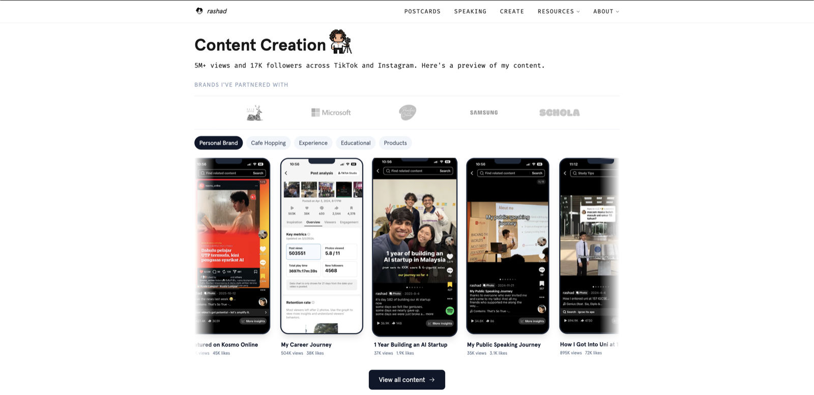</a><br/><sub><b>/create</b> — Content showcase</sub></td>
<td align="center"><a href="https://www.mfrashad.com/blog">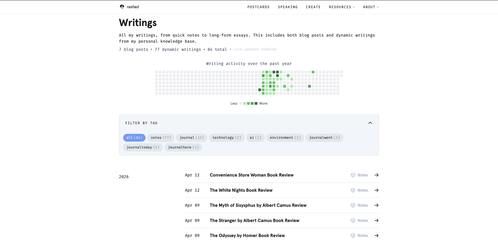</a><br/><sub><b>/blog</b> — Writing & notes</sub></td>
</tr>
<tr>
<td align="center"><a href="https://www.mfrashad.com/books">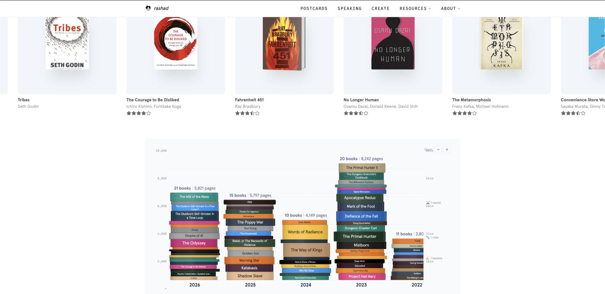</a><br/><sub><b>/books</b> — Reading list</sub></td>
<td align="center"><a href="https://www.mfrashad.com/movies">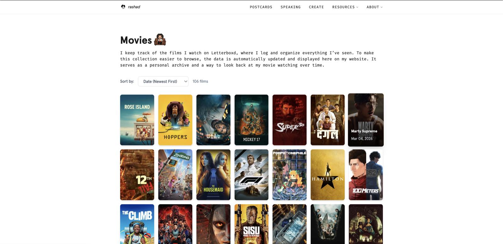</a><br/><sub><b>/movies</b> — Letterboxd diary</sub></td>
</tr>
<tr>
<td align="center"><a href="https://www.mfrashad.com/postcards">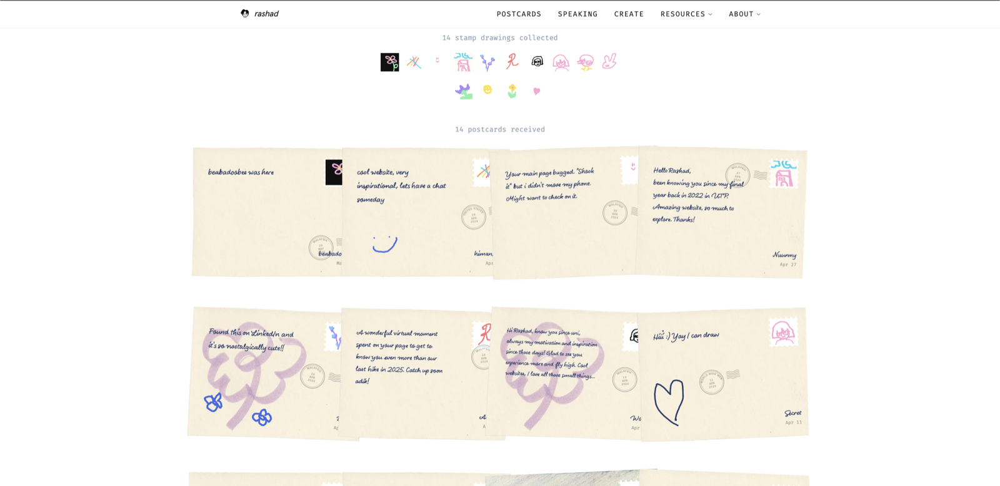</a><br/><sub><b>/postcards</b> — Guestbook</sub></td>
<td align="center"><a href="https://www.mfrashad.com/hobbies">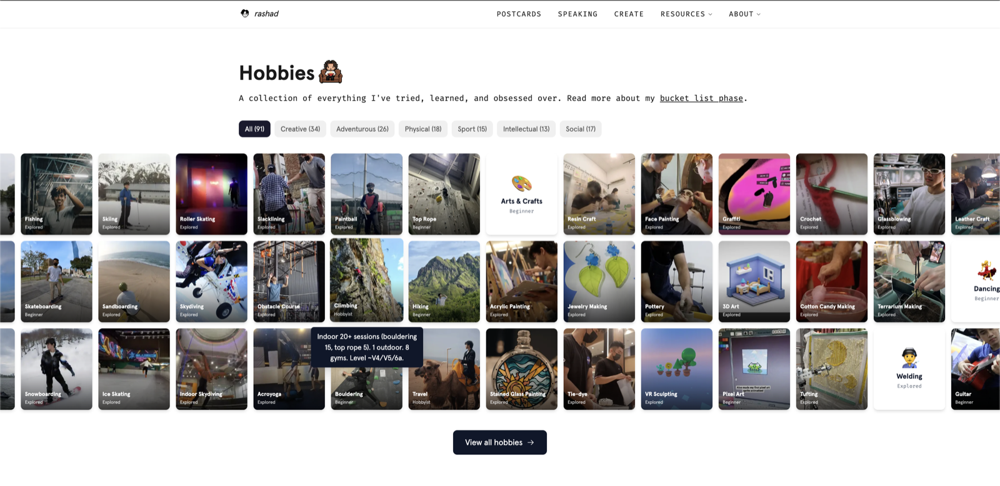</a><br/><sub><b>/hobbies</b> — Hobbies overview</sub></td>
</tr>
<tr>
<td align="center"><a href="https://www.mfrashad.com/diving">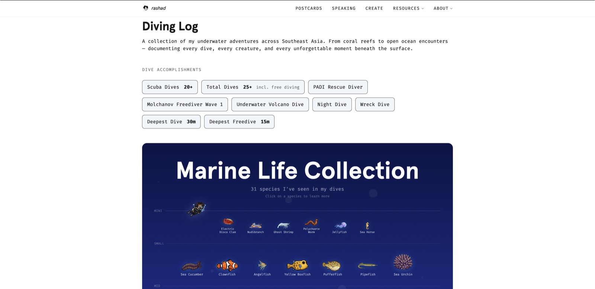</a><br/><sub><b>/diving</b> — Dive log</sub></td>
<td align="center"><a href="https://www.mfrashad.com/media">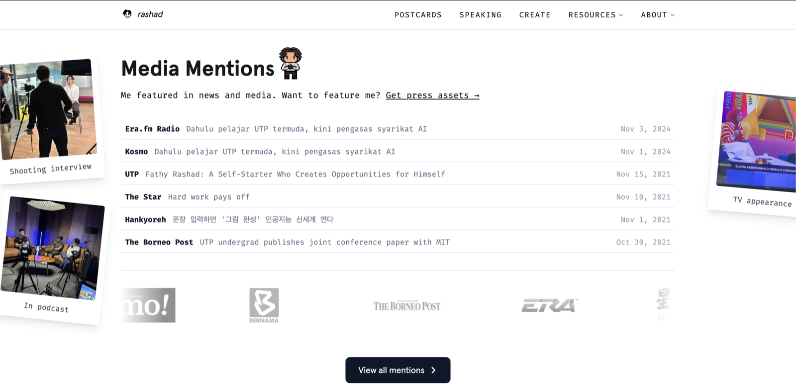</a><br/><sub><b>/media</b> — Press & mentions</sub></td>
</tr>
</table>

---

## Data Sources

| Feature | Page | Source |
|---------|------|--------|
| Blog posts | `/blog` | MDX content collection (`src/content/blog/`) |
| Notes / garden | `/blog` | Cleve (Convex HTTP) — `src/api/cleve.ts` |
| Books | `/books` | Hardcover API — `src/api/hardcover.ts` |
| Movies | `/movies` | Letterboxd scrape cached at `src/data/letterboxd-cache.json` |
| Bookmarks | `/bookmarks` | Raindrop.io API — `src/api/raindrop.ts` |
| Guestbook | `/postcards` | Turso (libsql) — `src/lib/postcards-db.ts` |
| Resources | `/resources/[category]` | 29 TS data files in `src/data/lists/` |
| Resource images | Resources cards | Manifest at `src/data/resource-images.json` (fetched by script) |
| Projects, skills, etc. | `/about`, `/achievements` | Local data files (`src/data/`) |

---

## Environment Variables

All variables are optional — the site degrades gracefully when a key is absent.

### Public (exposed to the browser)

| Variable | Used for |
|----------|---------|
| `PUBLIC_SITE_URL` | Canonical URL / OG tags |
| `PUBLIC_POSTHOG_KEY` | PostHog analytics |
| `PUBLIC_FORMSPREE_URL` | Contact form endpoint |
| `PUBLIC_CONVEX_URL` | Cleve/Convex garden writings |
| `PUBLIC_WEBMENTION_IO_DOMAIN` | Webmention badge |

### Server-only

| Variable | Used for |
|----------|---------|
| `CLEVE_PROFILE_SLUG` | Your Cleve username for `fetchCleveWritings()` |
| `TURSO_DATABASE_URL` | Guestbook/postcards DB |
| `TURSO_AUTH_TOKEN` | Guestbook/postcards DB auth |
| `HARDCOVER_API_KEY` | Books API |
| `RAINDROP_TOKEN` | Bookmarks API |
| `TMDB_API_KEY` | Movie poster images (build-time script) |
| `PEXELS_API_KEY` | Placeholder images (build-time script) |
| `WEBMENTION_IO_TOKEN` | Webmentions build-time fetch |
| `RESEND_API_KEY` | Server-side email (optional) |
| `GREENSCREEN_URL` | Local Python greenscreen server URL (admin only, default `http://localhost:8000`) |

Copy `.env.example` → `.env` for the full annotated list.

---

## Admin Tooling

Three local-only admin pages live under `/admin/`. They are gated by:

```ts
if (import.meta.env.PROD) return new Response(null, { status: 403 });
```

…so they are completely inaccessible on the deployed site. No authentication is needed locally.

| Route | What it does |
|-------|-------------|
| `/admin/content-generator` | IG/TikTok content studio (details below) |
| `/admin/resources` | Edit resource list metadata in-browser |
| `/admin/skills` | Manage the skill tree and achievements |

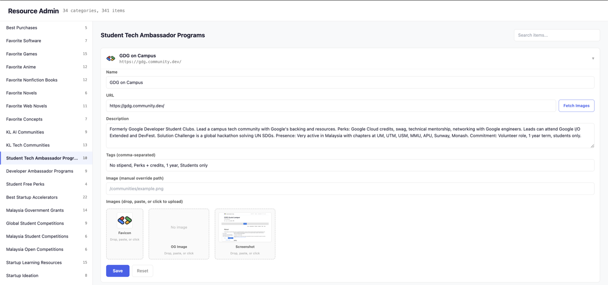

---

## ★ Content Generator

`/admin/content-generator` is a local studio that converts the site's curated resource lists into polished Instagram carousels and Reels/TikTok videos — without leaving the browser.

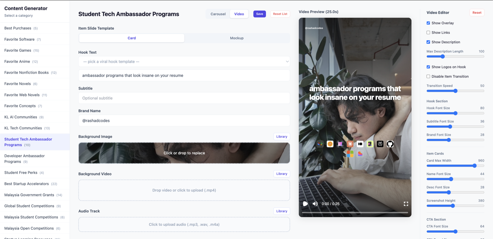

### What it produces

| Format | Dimensions | Render |
|--------|-----------|--------|
| Carousel stills | 1080 × 1350 px (4:5) | PNG per slide |
| Video reel | 1080 × 1920 px (9:16) | H.264 MP4 |

Output downloads automatically to `public/content-generator/output/`.

### Architecture

```
src/pages/admin/content-generator.astro   ← Astro page (forbidden in prod)
└── src/components/admin/ContentGenerator.tsx  ← ~2,800-line React studio
    ├── remotion/Root.tsx                  ← Remotion composition registry
    │   ├── CarouselHookSlide              ← Opening "hook" slide
    │   ├── CarouselItemSlide              ← One item per resource (card style)
    │   ├── CarouselMockupSlide            ← One item per resource (device mockup style)
    │   ├── CarouselCtaSlide               ← Closing CTA slide
    │   └── VideoReel (VideoComposition)   ← Full video combining all scenes
    └── src/pages/api/admin/               ← Server API routes (403 in prod)
```

### Workflow

1. **Pick a category** from the resource lists sidebar.
2. **Choose format**: Carousel or Video.
3. **Set the hook** — free-text or pick from built-in `VIRAL_HOOKS` / per-category default hooks.
4. **Configure branding**: subtitle, brand handle, CTA text.
5. **Choose item template**:
   - `card` — favicon + screenshot + description on a styled card
   - `mockup` — resource screenshot composited into a device frame via greenscreen
6. **Select & reorder items** from the category list.
7. **Upload a background** image or video. For videos, also pick an audio track.
8. **Optional per-item overrides**: custom screenshot, description, name.
9. **Persistent content descriptions**: per-item marketing copy is saved to disk and survives refresh.
10. **For videos**: hit **Detect Beats** to auto-set per-item timing from the audio track.

    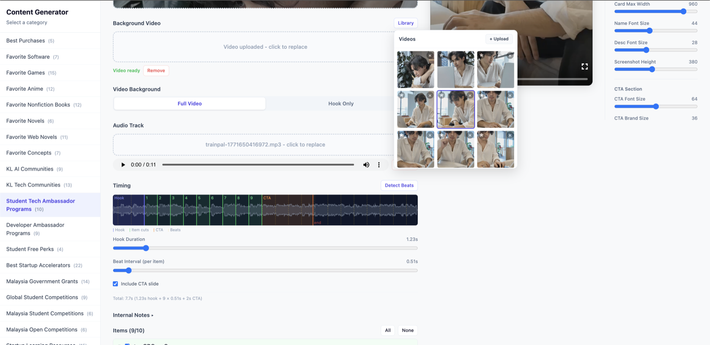

11. **Render** — the server bundles the Remotion composition and calls `renderStill` (carousel) or `renderMedia` (video). Output auto-downloads.

### Rendering

Live preview uses `@remotion/player` directly in the browser. Server render goes through:

- `@remotion/bundler` — Vite bundle of the Remotion composition
- `@remotion/renderer` — `renderStill()` for each carousel PNG, `renderMedia()` (h264) for the video
- API routes `render-carousel.ts` and `render-video.ts` orchestrate this

### Image pipeline

`src/lib/fetch-resource-image.ts` — triggered by `/admin/content-generator` when an item's image hasn't been fetched yet:

1. Opens a headless Chromium instance via Playwright to take a full-page screenshot.
2. Falls back to scraping `<meta og:image>` / favicon via `node-html-parser`.
3. Resizes/optimises with `sharp`.
4. Saves to `public/resource-images/` and updates the manifest at `src/data/resource-images.json`.

You can also pre-fetch images for an entire category with:

```bash
npm run fetch:resource-screenshots   # Playwright screenshots
npm run fetch:resource-images        # OG images + favicons
```

### Greenscreen mockups

The `mockup` slide template uses a sibling Python/OpenCV server for perspective-correct compositing:

```
../greenscreen/   ← separate repo, run independently
   └── server.py  ← FastAPI server, default http://localhost:8000
```

`src/pages/api/admin/greenscreen.ts` proxies requests to this server, which:
1. Detects the four corners of a greenscreen rectangle in a device-frame image.
2. Computes the perspective transform.
3. Composites the resource screenshot into the device frame.

Set `GREENSCREEN_URL` in `.env` if your server runs on a different port.

### API routes (all return 403 in production)

| Route | Purpose |
|-------|---------|
| `render-carousel` | Bundle + render all carousel PNGs |
| `render-video` | Bundle + render MP4 reel |
| `greenscreen` | Proxy to Python OpenCV server |
| `upload-image` | Save a user-uploaded item image |
| `upload-background` | Save a background image/video |
| `media-library` | List saved media; converts HEIC → JPEG via macOS `sips` |
| `media-defaults` | Persist per-category default media selections |
| `content-descriptions` | Read/write per-item marketing copy JSON |
| `fetch-images` | On-demand Playwright screenshot + OG scrape for one URL |
| `lists` | Serve resource list data to the studio |
| `category-cache` | Persist the full studio state for a category |
| `list-notes` | Per-category freeform notes |

### State persistence

Per-category studio state (selected items, hook text, branding, overrides), media defaults, and content descriptions are all saved as JSON under `public/content-generator/`. They survive page refresh and can be committed to sync across machines.

### Requirements

- **macOS** — `media-library` uses the built-in `sips` command for HEIC → JPEG conversion; Playwright's bundled `chrome-headless-shell` is macOS-targeted.
- **Local dev server** running (`npm run dev`).
- **Python greenscreen server** (only needed for `mockup` template): `cd ../greenscreen && python server.py`.

---

## npm Scripts

| Script | What it does |
|--------|-------------|
| `npm run dev` | Start dev server on :4321 |
| `npm run build` | Astro build → post-process Vercel functions |
| `npm run preview` | Preview the production build locally |
| `npm run fetch:movies` | Scrape Letterboxd → `src/data/letterboxd-cache.json` |
| `npm run fetch:cleve` | Fetch Cleve writings → `src/data/cleve-cache.json` |
| `npm run fetch:resource-images` | Fetch OG images + favicons for resource cards |
| `npm run fetch:resource-screenshots` | Playwright screenshots of resource URLs |
| `npm run fetch:book-covers` | Fetch Hardcover book cover images |
| `npm run fetch:game-anime-images` | Fetch TMDB/IGDB images for games + anime |
| `npm run build:links` | Generate link graph from content |
| `npm run build:topics` | Generate topic index from frontmatter |
| `npm run build:webmentions` | Fetch webmentions from webmention.io |
| `npm run remotion:studio` | Open Remotion Studio for composition preview |
| `npm run chrome:debug` | Launch Chrome with remote debugging (for Playwright dev) |
| `npm run process:speaking-images` | Optimise speaking-event photos |
| `npm run process:content-images` | Optimise content-generator output images |

---

## Deployment

The site is deployed on **Vercel**. Push to `main` → automatic deploy.

Required env vars to add in the Vercel dashboard (Settings → Environment Variables):

```
PUBLIC_CONVEX_URL        # Cleve garden
CLEVE_PROFILE_SLUG
PUBLIC_POSTHOG_KEY
PUBLIC_FORMSPREE_URL
TURSO_DATABASE_URL       # Guestbook
TURSO_AUTH_TOKEN
HARDCOVER_API_KEY
RAINDROP_TOKEN
TMDB_API_KEY
WEBMENTION_IO_TOKEN
PUBLIC_WEBMENTION_IO_DOMAIN
```

The site builds and runs without any of these set — missing integrations are silently skipped.

---

## License

**Code** — MIT. See [LICENSE](LICENSE).

**Personal content** — all blog posts, photos, project descriptions, and brand assets remain © Rashad. All Rights Reserved. See the Personal Content section of [LICENSE](LICENSE) for details.

**Fonts** — bundled fonts are licensed separately. See the Fonts section of [LICENSE](LICENSE).
