# My Annual Review 2023

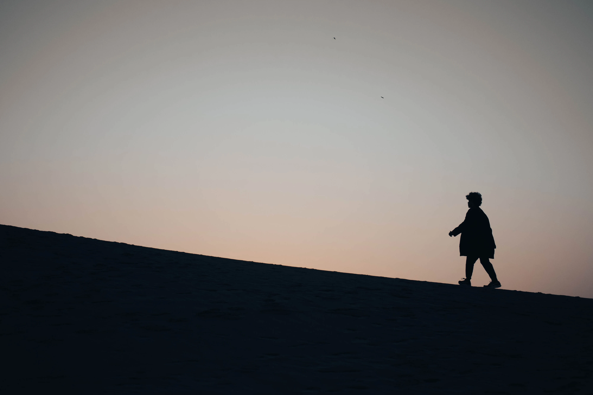

2023 was my year of transitioning from chaotic adventures to habits and routines.

I spent the first half of 2023 continuing my *bucket list phase* from 2022. A phase where I constantly try new things.

Whether it's skydiving, co-piloting, scuba diving, freediving, surfing, windsurfing, glassblowing, sandboarding, snowboarding, or skiing — I tried it all. It was chaotic phase full of spontaneous adventure, but ultimately satisfying.

I ended the phase in July 2023, when I then shifted to a more organized life. I spent the latter part of the year building routines and forming the habits that I want.

Starting a journaling habit was actually the trigger of how this post came to be. I've always wanted to write an annual review since years ago but something always stopped me. Journaling and having a clear record of what happened in 2023 makes writing this a lot easier.

> Many people think they lack motivation when what they really lack is clarity
> — James Clear, Atomic Habits

This review will be structured in 3 sections:
- What Went Well
- What Didn't Go Well
- My Goals for 2024

I will first reflect what went well and what I learned from it. Then, identify what I could improve from things that didn't go well. Finally, I will share my goals and how I would achieve it for 2024.

## What Went Well?

### I. Travel & Adventure

In April, I went on a solo trip to Japan and Philippines. I had been aiming to go there specifically because I wanted to tick off my bucket list on snow sports and diving.

The plan was actually almost cancelled after getting ill near the planned date. But I recovered barely in time before winter ends and pushed for the trip. It also means I had to travel during fasting month of Ramadhan, which is an interesting experience by itself (I saved a lot of money on food & had iftaar at Japan mosques).

#### Japan: Snow, Sand, and Sakura

I had many first experiences in Japan. From experiencing my first snowfall and sakura blossoms, snowboarding and skiing, trying out glassblowing. Seeing so much sand for the first time in sand dune and riding a camel. Yes, sand dune. Not many people know there is a desert in Japan. I even tried sandboarding on the sand dune.

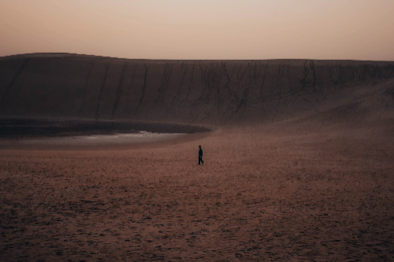 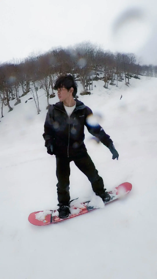

Some memorable social interactions also happened in the trip. My favorite one was hiking together with a stranger after we helped each other take pictures. We even got a sakura flavored ice cream together at the end!

I learned many things from the trip:
- I learned more about planning (thanks r/JapanTravel) and applying for visa early.
- I became more confident in travelling solo, like staying in hostel and socializing with fellow travelers.
- I got used to walking far distance and started walking more after the trip
- I became more comfortable in taking self portrait and doing the walk of shame to the camera. I improved my photography skills a lot.
- I finally experienced how winter and cold country feels like.

I also made many mistakes that became lessons and fond memories now. From sleeping in the airport after missing the last train and finding out it's not so bad after all. Or dropping off train at the wrong small village, that turns into a nice photoshoot sessions with train tracks and mountains.

I learned to be more comfortable in spontaneity. And to practice the habit of seeing the upsides in misfortune and viewing them as possible lesson and serendipity.

> Looking for the positive side of every challenge can become a habit, and so can finding the cloud in every silver lining.
> — Jeff Olson, The Slight Edge

There were many other anecdotes that'd be too long to include. Instead, you can checkout my Japan trip post in the future for more details on the activities, costs, etc.

#### Philippines: Whale Shark and Sardines

After Japan, I went to Cebu in Philippines. My main goals were to swim with the Whale Shark and dive amongst millions of fish in a sardine run. Both were majestic experiences. One left me in awe with the vastness of size and the other with the number of lives swimming around me. I wish to see an even bigger animal like the blue whale one day.

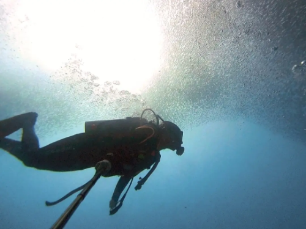 

The trip was also the pivotal moment where I started to really enjoy diving. My previous dives before this was the diving course. I did my diving course in rough weather during monsoon, where I'm constantly stressed with learning the skills in low visibility and rough waves. The dives in the Philippines were the moment where I could truly relax and explore.

#### Family Dive and Underwater Volcano

Few days after the trip. I celebrated Eid Fitri with my family in Sabang (The Weh Island), Indonesia. A fond memory where my whole family tried diving together with Discover Scuba over there.

Sabang surprisingly has many fish. But the corals suffered a lot due to the tsunami.
There is also an underwater volcano in Sabang. A unique albeit quite underwhelming experience. It's mainly small holes with bubbles, where the surrounding water are warm.

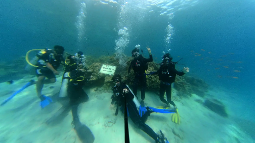

#### Rescue Diver Course and Night Diving

Still not satisfied with diving, I went on another diving trip to Perhentian Island where I took Adv + Rescue Diver course.

The course took 1 week and gave me many new diving experience. One of my favorite course was the search & recovery specialization where the instructor hide a small item like a bracelet in the sea, and we are supposed to search it. We also practiced on real situation where we volunteered to search a missing fin by another diver.

Besides that, the roleplay element on the rescue course was also fun. Watching the girls' distressed acting can be very entertaining. And we also learned CPR and other life saving skills in the course.

While still in the island, I also went on my first night dive which became one of my favorite. I loved the silence during the night. The limited light by the diving torch also makes me fully focus and be present on certain spot.

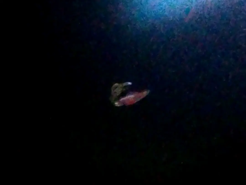 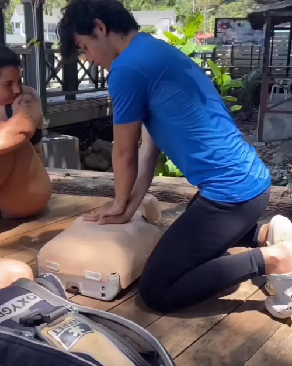

Seeing bioluminescence during the night always left me in awe. The first bioluminescence I saw was a cuttlefish with a glowing belly. The second was glowing red and blue planktons swarming our torch light.

Another favorite creature I discovered was ghost shrimps, a shrimp with transparent body. I also encountered many sea creatures that I never see during the day. I remember noticing many sea urchins — and they were moving! The only cons of night diving to me was the blurry videos I got due to the low light.

#### Freediving

My final adventure was a freediving trip in Tenggol island.

I've had few classes on freediving in the city and only need to do some final practice on the open water for the certificate. We would swim from the beach a bit far to the sea , with a life buoy on tow. Then we'll lower down a line from the buoy. The line will be used as assistance when freediving to the bottom. We will take turns freediving one by one. While we take our rest gasping for breaths, the instructor will diving tirelessly for our safety.

On my first day, I struggled to equalize my ear. Equalizing your ear means pushing out air from your ear to balance the ear pressure to the water pressure at depth. I had no problem doing this normally, but cannot do so when I'm upside down.

I managed to do it on the second day after using this trick of sucking my nose & mask before equalizing. But I also end up popping blood vessels in my eye and nose by doing so. By sucking the air from my mask air pocket, it also pressurize my mask, which proved to be too much pressure for my blood vessels. Thus, I had bloody eyes and nose after the dive.

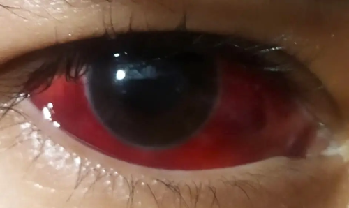

Luckily, there was a doctor amongst the student and he relieved me by saying it's not fatal and will be gone in few weeks. My eyes continued to be completely blood red for about 2 weeks before it recovers.

Anyway, I was happy I got my Molchanovs freediving cert with my best depth at 15m. Despite the exhausting training during the trip, I find the sport aspect of pushing yourself in freediving and the trip enjoyable. Although I still prefer scuba diving for recreational sea exploration.

Overall, after constantly pushing myself to near-drowning, I definitely become more confident in being underwater.

### II. Self-Improvement

After all my traveling and diving, I started to run low on money.

I decided that it's finally enough and I should focus on work again. However, shifting from constantly having fun with novel experiences back to daily grind of work proves to be quite challenging. I end up spending my days on my phone constantly looking for dopamine and barely able to put any work hours in.

I realized I need to restructure my life. Then, I remembered about Atomic Habits. I didn't apply the book on forming habits previously with the excuse that my life is too chaotic when I constantly try new things and I wanted to experience life full of spontaneity for a while. But now that I ended my *bucket list phase*, I had no excuse anymore.

#### Habits

So, I started to fully apply the Atomic Habit lessons. Starting with my phone or dopamine addiction.

*Make it difficult* — I deleted my social media apps.

*Make it unattractive*  — I put my screen time in my home screen, so I'm always reminded how much time I wasted on phone.

Then, I replaced the instant gratification activities with reading non-fiction books. And it worked. Most of my time spent on phone was then spent on reading non-fictions on my kindle instead.

Next, I started forming other basic habits: waking up early & Tahajud prayer, lifting weights, journaling, eating enough calories, and reading before sleep.

*Make it easy* — I searched for tools I'd enjoy the most and make it the easiest for me. I chose Diarium for journaling.

*Keep track of progress* — I use Habit Loop for tracking habits, Strava to track running distance, Smashrun for running achievements & statistic, and Rize for time tracking.

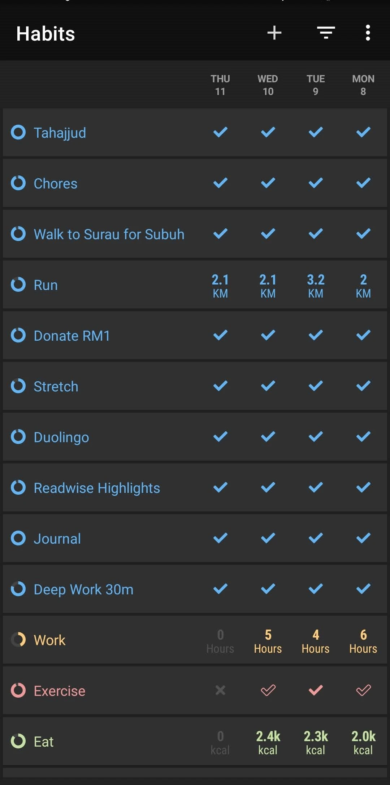

Tracking habits and keeping my streaks was the biggest motivator that kept me consistent with my habits. Despite a few early failures, I was able to keep my habits for about 2-4 weeks.

However, one day after completing a stressful project, I celebrated by playing a game. This became my downfall as I spiraled into binge gaming for about 1 and half months. I couldn't stop playing Baldur Gate 3 and The Outer Wild once I started it. This was the caveat of streaks, one relapse can easily snowballs to more once I lose my streak.

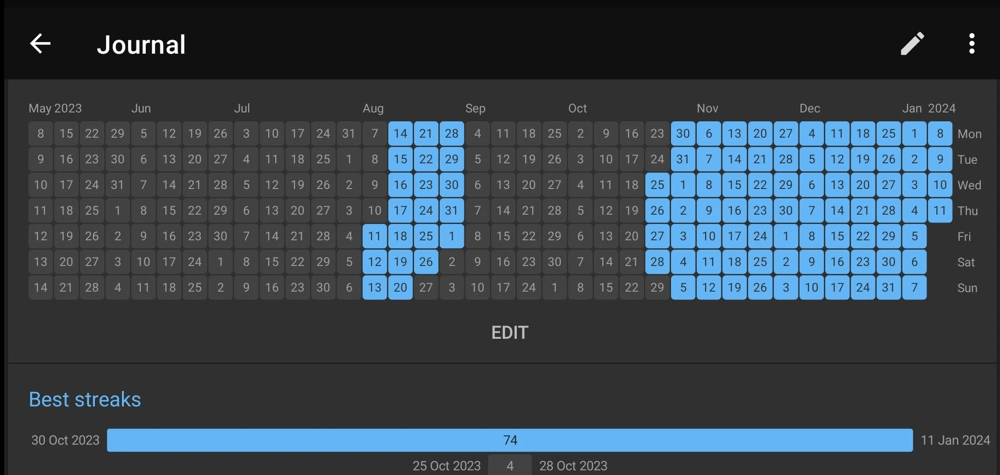

After completing the games, I was able to restart my habits again. Thus, I started adding new habits week by week. I had this idea of applying the book I read as a new habit.

For example, I was inspired to run and seek discomfort after reading Can't Hurt Me by David Goggins. So I added a habit of doing chores, running, and stretching everyday. And I stacked the habits as part of the morning routine.

Then, I was inspired in donating more after reading Doing Good Better: Effective Altruism. So I started a donation habit. And I did the same for several other books.

In the end, I managed to kept the habits until the end of the year. Which is why I considered as a success. It became easier once I passed the 30+ days streak.

### III. Fitness

Fitness was the only thing I was able to keep fairly consistent over the full year.

Even during the least productive period or binging sessions, I would still do a short exercise once in 2 week at minimum. Having a home gym equipment like pull-up bar, dumbells, and gymnastic rings were the game changer on making this possible.

It's about reducing the friction to workout as much as possible. Doing a pull up or a ring dip would only take a few seconds every time I walked around the house.

However, I noticed that my posture is getting worse despite all the exercise I did. I had a slight Anterior Pelvic Tilt (APT). Although prolonged sitting may have affected this, I also suspected muscle imbalance may play a role. I thought so because I didn't do a full-body balanced workout routine.

My home workout mainly focused on weighted pull ups, with some ring dips, overhead press, and occasional pistol squats on the side. Thus, I have overdeveloped lats compared to other muscles, minimal leg muscles, and less developed lower traps and rear delts.

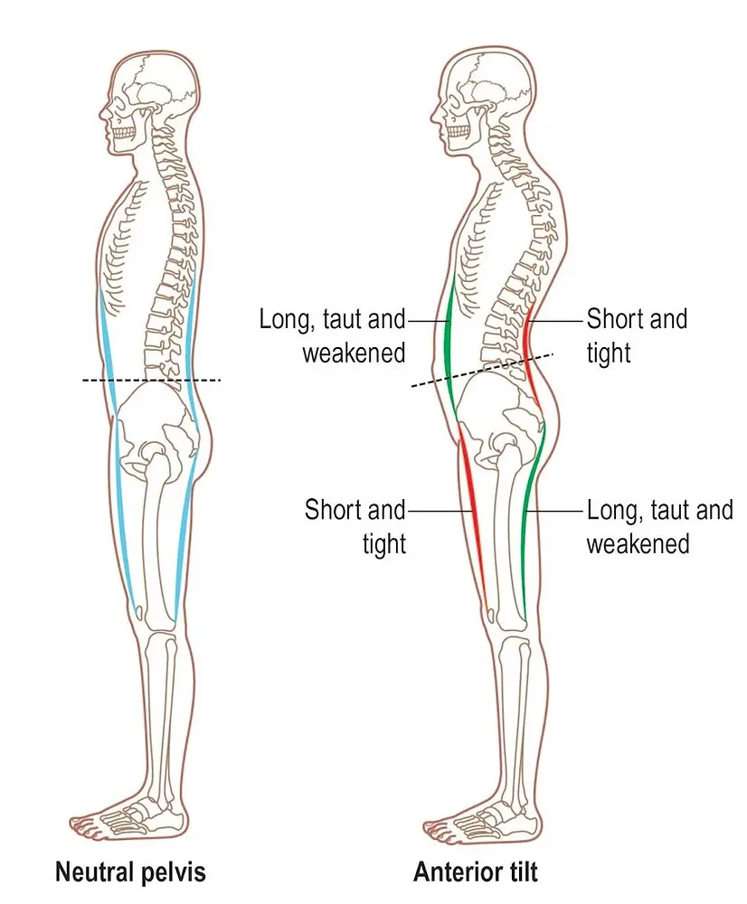

APT is often associated with weak glutes, tight hip flexors, weak abdominals, and tight back. Although I don't have severe case of any of them, the combination of my less developed glutes, overdeveloped lats, and my prolonged sitting probably adds up and caused the slight APT.

#### Gym

To fix my posture, I started going to the gym to train deadlift and squat around June.

There is a small local gym near me within 10 min of walking. It used to be too far for me. But I became a lot more comfortable in walking far distance after my trip from Japan. Thus, I had no problem walking to the gym regularly.

Why did I switch to gym? Training legs is quite difficult with just bodyweight. After I can do few pistol squats, I find it hard to progress further. My other calisthenic exercises have also stalled. Weight training on the contrary is a lot easier to progress:
1. I can add heavier weight than my bodyweight,
2. I can add smaller increment in weights
3. I can keep track of the weights more accurately.

Despite all that, the main reason that convinced me was because I kept hearing how beneficial deadlift and squat exercises are. Like the testosterone boosts or how functional the movement is.

Anyway, I focused on 3 main lifts in the gym: Deadlift, Squat, Overhead Press, and Row. I also do accessories exercise like face pull & lateral raise at the end of workout.

By the end of the year, my posture improved. I believe it was mainly due to doing deadlift, rows, and face pull as it strengthen my weak muscles — glutes, hamstring, lower back, traps and rear delts.

Here are my best lifts over the year:
- 120kg Deadlift
- 70kg x 8 Squat
- 70kg x 5 Bench Press
- +35kg Weighted Pull-up
- 50kg x 5 Barbell Overhead Press
- 60kg Pendlay row

I also successfully gained weight close to my bulking goal. I gained 9kg this year, from 60kg to 69kg. My target was 70kg, with minimal fat gain. So I consider the 90% completion rate as a success.

#### Running

Besides building muscle, I also started my running streak this year. I was inspired to run everyday after reading Can't Hurt Me by David Goggins. I'm aware that running daily without rest day may not be the most optimal for improving my running. However, my goal is more about achieving self-discipline and mental toughness instead of solely improving running. I was inspired by David Goggin's mental toughness, not his cardio health.

I'm also aware that chance of injury will increase by running everyday. So I made few rules to ensure the intensity is manageable:
1. My minimum run is 1 mile or 1.6km
2. I can run at extremely slow pace (e.g 8-9min/km) or alternate run/walk during rest day.
3. I can just walk the distance when I'm sick or injured
4. Keep the pace slow most of the time. Only push hard once or twice a week.
5. Slow down or do the minimum distance if I start feeling any slight pain

With those rules, I managed to keep a 33 day run streak from 29 Nov until the end of the year. And still continuing the streak in the new year.

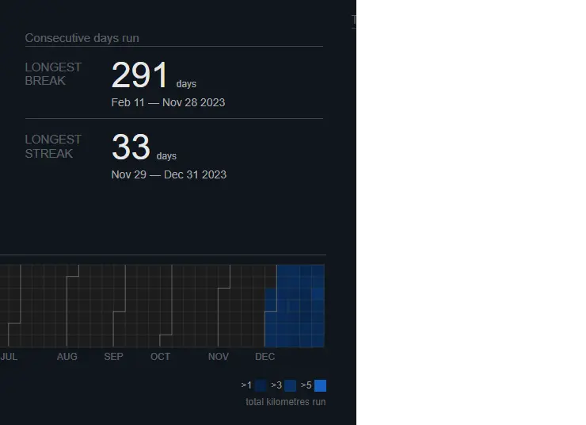

## What didn't go well this year

### I. Writing

I set a goal of writing 1 tech article every month in my medium blog at the start of the year. How much did I write this year? Zero.

Why didn't I write anything?

I suspect it's because my interest was more focused on travel and self improvement this year. But, I kept telling myself to write AI or tech articles.

I had gained a small followers on Medium by solely writing tech articles. So I was afraid I'd lose them if I write things on other topics. In the end, I did not write anything.

Now that I think about it, the loss of potential new readers by not writing anything probably exceeds the loss of disappointing my current small followers anyway.

What can I improve in the future?
1. Setup a separate blog for other topics or niches (which is why I setup this blog). Or post it on Medium anyway regardless of the niches or why the followers followed me.
2. Start writing atomic notes of whatever I learned and use that as a starting point. I discovered about Personal Knowledge System and the Zettelkasen method this year. They showed me the power of notes and how it can make writing easier by not starting from a blank page.
3. Start a writing habit. Set aside a small time everyday to write my article.

### II. Health

Many of my plans and goals started to derail in February.

In that month, I got an unexpected infection that hospitalized me for a few days and required a minor surgery. The doctor left the surgery with an open wound instead of stitching it. So I had to live with the pain of having a gaping wound for a month until it recovers. Simple activities like driving, sitting down, and walking becomes unpleasant, or even painful. To make it worse, I also have to visit a clinic to change the wound dressing, every day.

The unexpected medical issue was a frustrating and humbling experience. Especially since I exercise regularly and thought that I have a fairly healthy lifestyle.

The experience reminds me about the unpredictability of life and to be more grateful. It was a reminder that my plans can be derailed at any moment and that my health is a gift that shouldn't be taken for granted.

### III. Work

With the medical issue in February and March. I had problem focusing at work with all the discomfort and pain. So I ended my contracted works. Thinking of just restarting the contract or finding new clients altogether once I recover.

Once I recovered and finished my break. I started working again in July. But I spiraled into binge consumption again in September. Only then I realized that the lack of structure in my schedule is negatively affecting my productivity. I've entered the situation Jeff Olson described in his book.

> Serving as your own boss, and doing so successfully, consistently, day in and day out, takes an uncommon degree of slight edge integrity, and frankly many business owners just don't have it. They become intoxicated by the freedom of being their own boss and fail to maintain the kind of structure it takes to become successful.
> — Jeff Olson, The Slight Edge

In summary, I only worked for about 6 months this year. A significant decrease of productivity than last year. I was also quite motivated to try launching a SaaS business this year after reading The Millionaire Fastlane book. Although, I did build few prototypes. I did not ship anything. I believe the issue was planning and prioritization. I'm still uncertain on how I'd best go for the business. And I'm also being distracted with working on too many goals, which results in lack of progress in some of them.

What can I improve in the future?
1. Schedule and time block deep work sessions. Make it a habit.
2. Keep track of progress like work hours and streaks.
3. Block all distractions during work sessions. Use tool like Rize.
4. Prioritize. Decide what I would want to give up.

### IV. Social Life

My first month was full with social interactions.

I started the new year with a Genting trip with friends to celebrate Marylin's birthday. We counted down new year, walked around the theme park, played in arcade, tumbled in kids area, and took a lot of photos.

Late in January, I also had my first house visit since secondary school! I went to dinner party in Alina's house to celebrate Melissa's birthday. We had boardgames, dinner, dances, and whole lot of fun!

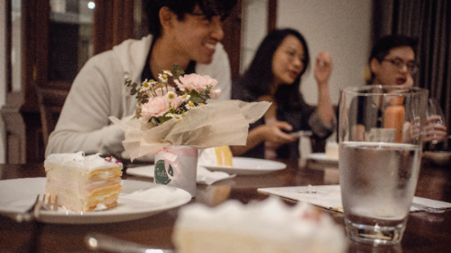

My social activities stopped when I got ill. I appreciated all my friends that checked in me. But when I'm ill, I like to escape to fantasy land to forget my discomfort.

Thus, I have this tendency to self-isolate and binge on games and books when I'm sick. Having to check my socials and reply to messages just reminds me of the real world. So I tend to reply very late or not at all. Eventually, we just stopped interacting all together as I continued being a hermit even after I recovered.

The fact that I don't really feel lonely didn't help my social life either. Once I've become used to being alone, it's hard to start the initiative to socialize again. As shown on [this study](https://www.cell.com/cell/fulltext/S0092-8674(21)00178-1?_returnURL=https%3A%2F%2Flinkinghub.elsevier.com%2Fretrieve%2Fpii%2FS0092867421001781%3Fshowall%3Dtrue), chronic social isolation can actually cause anti-social behavior.

In the end, besides my solo trips, I spend the rest of the year mostly staying at home. Although, I think my mental health is fine with my minimal interaction with family. My social skills definitely deteriorated. I know it can't go on like this. I probably have loss many opportunities because of my lacking social skills and ability to maintain relationship.

What can I improve in the future?
- Participate in social clubs or hobbies regularly
- Improve my ability to express myself (Join toastmaster, improv, debate, speech & drama, or public speaking class)
- Take more social initiative. Create a habit of taking social initiate and a system for follow up.
- Create more opportunity for 1-1 conversations to form bonds faster.
- Be more vulnerable and express my opinions openly. Filter compatibility quickly and meet more people instead.

PS: One fortunate event though was discovering Slowly and trying out pen palling in December. I surprisingly had many enjoyable deep conversation from the app. I loved the delayed long-form messaging and writing long letter. It felt like pair journaling. I also noticed that my writing becomes more structured when I'm writing to someone. So I might even be able to reuse it in my blog later.

## Goals for 2024

My main goals for 2024 is to keep doing my current habits consistently with the year's theme as self-discipline.

> All the information you need is already there. You're already doing the actions. All you need to do is choose to have them serve and empower you—and keep on choosing
> — Jeff Olson, The Slight Edge

As the quote says, I think I've already known enough on what to do to reach my goals and I may be already doing it. I just need to *keep doing it*. I should avoid the endless researching trap and actually just do it. Instead, I need more consistency and bias for action for this year.

Like how I spent 2022 reinforcing my identity as adventurous person by constantly trying new thing. I want to reinforce my identity as disciplined person by doing amazing feat of discipline in 2024. As the evidence grow, hopefully so will my identity.

> Your identity is not set in stone. You have a choice in every moment. You can choose the identity you want to reinforce today with the habits you choose today.
> — James Clear, Atomic Habits

Anyway, here are some of my goals for 2024:

(The way I set goals is I try to set a specific goals with trackable metric and also the a system or daily action to achieve it.)

#### Outcomes
- Ship a product/Launch a SaaS business
- 366 running day in a year
- 1000km total year running mileage
- Run a marathon
- 150kg deadlift, 60kg OHP, 100kg BP, +40kg weighted pull up, 3x FHSPU
- 300 days of waking up early/Tahajjud in a year
- Complete Duolingo Arabic Course
- Read 25 books & write the book reviews/summary
- 50 blog posts
- Build my social and communication skills

#### System
- Work on building my own product x hour per day
- Run minimum 1.6km or 1 mile every day
- Workout 3x a week
- Wake up early/Tahajud everyday
- Duolingo everyday
- Read everyday, 1 book every 2 week
- Spend an hour writing every day, publish 1 blogpost a week
- Toastmaster 2x a month, join running club/improv class
- Initiate more 1-1 chats with people, at least once a month?

I realize that it's a lot of goals and I may need to prioritize. So my main focus would be working, running, reading, and, writing. If I feel overwhelmed at some point, then I may just drop the other goals.
