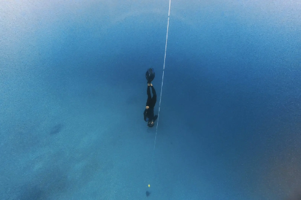
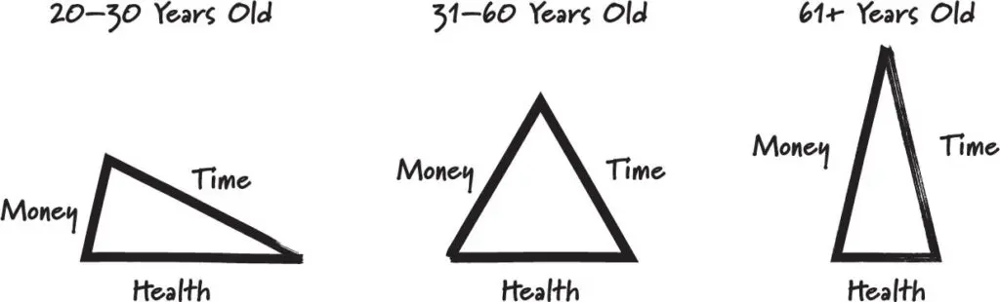
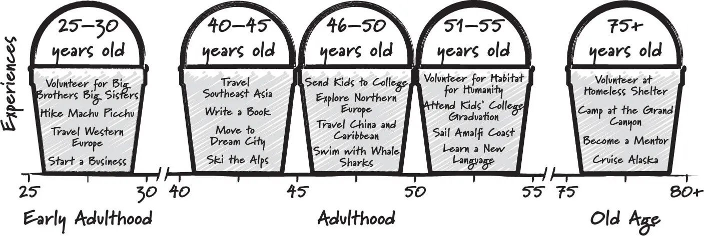

# Bucket List Phase: Practicing Bias for Action in Adventures

## What I mean by Bucket List Phase

A 'bucket list phase' is a phase where I try to rapidly tick off as many bucket list items as possible in a short time period.

The phase lasted for 1.5 years, and I ticked off about 50+ things in my bucket list. From surfing, skydiving, scuba diving, freediving, co-piloting a plane, dancing, rock climbing, snowboarding, skiing, sandboarding, solo traveling etc.

## Why?

I had three main reasons - to practice bias for action, to optimize experience, and to be adventurous.

### Practicing Bias For Action

Most people dreams, but only few people actually does things.

This is the common problem with bucket list. We list down big dreams and goals. But it stays as ideas. There can be many things that preventing us from taking action, for examples:
- Uncertainty — We don't know how to accomplish it so it feels distant and impossible.
- Fear — We fear uncertainty, and we don't even try because we're afraid of failing
- Overthinking — We think all the excuses why it cannot be done like time and money (without actually researching).
- Procrastination — We decide we will do it later (but actually never).

A bias for action is the ability to overcome all this friction and go into action over inaction quickly.

> Don't let fear dictate your decisions. Take risks and embrace the unknown.
> Bill Perkins, Die With Zero

Fortunately, we can actually do something to reduce the uncertainty, fear, overthinking, and procrastination. Thus, improving our bias for action. Here are some ideas:

#### Uncertainty

Gain clarity by planning and researching on how to do it.

Break the goal into small steps and plan the specific like when and where to do it.

For example, flying a plane sounds like an impossible dream at first because of the cost. And after researching the cost for Private Pilot License, I indeed cannot afford it. But after further research, I found there is a One Day Pilot program where you can try experiencing co-piloting a plane for just RM800. There are also similar trial program to garner interest in aviation and being a pilot.

#### Fear

Identify the fear and inspect whether it is rational or irrational. We often have many bias that exaggerate the fear.

If it's valid fear, take a calculated risk and decide whether you actually want to do it.

For example, skydiving sounds extremely dangerous. However, after looking at statistic, it can actually be safer than driving a car. Base jumping on the other hand has a pretty high rate of fatality. So I decided it's not worth the risk.

Another advice is to face your fear gradually (exposure therapy).

For example, if you have social anxiety. You don't have to go straight to talking publicly to thousands of people. You can gradually increase your exposure to your fear. Meet people without talking, then start talking to one person, then two, then three, and so on. Apply this to many things, whether it's dancing, performing, or diving.

#### Overthinking

Overthinking is often caused by fear and uncertainty. Identifying and resolving both with the above can help.

Sometimes, overthinking makes things seems more difficult than it really is. This because thinking in our head is often biased with our fear and emotion.

One thing I do to keep my thinking efficient and logical is to clear and organize my thoughts with journaling. I try to avoid repetitive thinking and structure my thoughts. Then reflect on my thoughts whether it's rational or biased by emotion.

Overthinking can also cause procrastionation.

We often procrastinate due to lack of clarity. So plan where and when to do it and commit.

If you still never get motivated to do it. Then maybe you don't actually want to do it and just following what other people think it's cool. Re-evaluate your goals again.

> "Let go of the need for approval from others. Live life on your own terms."
> — Bill Perkins, Die With Zero

**All of this can be practiced as skills and made into habits. That means we can train ourselves to have bias for action.**

So, my solution is to practice all these steps until it becomes ingrained.

I would try to tick off a bucket list item every week. For each goal, I would research on how to do it, then try to do it as soon as possible.

For example, there are many times where I saw an interesting activity ad, add it to my bucket list, booked the earliest possible date, and actually doing it — all in one week, or even a day.

### Optimizing for Experience

The reason I'm doing some of my bucket list now is to optimize the experience.

The idea to not delay my 'bucket list' anymore came to me after learning about time-bucket concept from the Die with Zero book.

The book argues that certain experience can be better enjoyed at certain period of our life.

Skiing in our 60s might not be as enjoyable as skiing in our 20s with healthy knees. Backpacking might be more suitable while you are young, where you are at similar age with other travelers, more comfortable with discomfort, and may be broke. Luxury travel might be preferred when you are older, richer, and used to luxury.

This is because we have varying life resources (time, money, health) at different part of our life.

So in order to optimize the benefits and cost from the experiences. We should list all the experience we want to have, and set the best time period to have them based on our resources. This is what we call 'time-bucketing' our experiences.

For me personally, my early adulthood bucketlist would be trying extreme sports, backpacking, and start a business while I'm still young, fit, and have little commitment.

But, everyone's resources and timeline may be different, so make plans based on your own.

When I started this, I felt like my timing was perfect. I just recently graduated with no other commitment, my freelancing were going well, I have a lot of time and flexibility.

Note that it also doesn't necessarily mean it's too late to start something that is better done when you are younger. Time-bucketing is about optimizing your future experience. Doing it late is still better than never doing it at all.

You may also want to consider other factors beside time, money, and health. For example, let's say a family might not be around in 3-5 years. So you might want to spend more time with them early on. Or if there is a place you want to visit that will be destroyed in a few years. You might want to travel there early even when you don't have much time at that period.

> People often delay their dreams too long until the point where they aren't even physically capable of doing it anymore.

### Being Adventurous

The third reason is because I wanted to be adventurous.

It may have stemmed from my childhood dream of being a polymath. I've always wanted to learn and experience everything. My bucket list was full of trying new things.

However, the reality is different. The past 5 years before I started this, I always stuck with programming. It's likely my fear of looking stupid at trying new things. But I also justified that I need to focus on programming.

Although my focus helped me succeed in programming, it also brings disadvantages. I had a hard time relating with others.  Unless we have a common interest in programming, I'd have nothing to talk about and I was too narrow minded to be interested in their interest. My lack of social skills also didn't help me in asking questions.

I also realized that my narrow focus can cause me to have tunnel vision in my career and programming.

Creative ideas often comes from intersection between two seemingly unrelated areas. A [study](https://www.researchgate.net/profile/Kendell-Pawelec/publication/247857346_Arts_Foster_Scientific_Success_Avocations_of_Nobel_National_Academy_Royal_Society_and_Sigma_Xi_Members/links/00b4953c00f875f191000000/Arts-Foster-Scientific-Success-Avocations-of-Nobel-National-Academy-Royal-Society-and-Sigma-Xi-Members.pdf) shows Nobel prize winners are 2.85 times more likely to have artistic or craft hobbies. Many other studies also shows the importance of pastime and diverse interest. Thus, being adventurous and having various experience might actually help me becomes a better researcher or engineer.

So, once I graduated, I decided to be more adventurous.

In order to do that, I followed James Clear's advice.

> Every action you take is a vote for the type of person you wish to become. No single instance will transform your beliefs, but as the votes build up, so does the evidence of your new identity.
> – James Clear, Atomic Habits

Each new thing I tried every week becomes a vote in reinforcing my identity as being adventurous. As the experience and evidence builds up, I've become more confident in embodying that identity.

## Avoiding Pitfalls

There are few things I did when planning my bucket list phase: setting a time limit to get off the hedonic treadmill and optimizing for new experience rather than new locations.

### Set a time limit to get off the hedonic treadmill

Use hedonic treadmill to your advantage.

Once your every week is full of thrilling and exciting adventure, your baseline for happiness will increase. You will keep craving for next novel experience to stay happy. I use this craving as powerful motivator in taking actions for the next goal. However, when uncontrolled, you may end up endlessly seeking new experiences while ignoring other priorities in life.

> The world has an effectively infinite number of experiences to offer, so getting a handful of them under your belt brings you no closer to a sense of having feasted on life's possibilities. Instead, you find yourself pitched straight back into the efficiency trap. The more wonderful experiences you succeed in having, the more additional wonderful experiences you start to feel you could have, or ought to have, on top of all those you've already had,
> - Oliver Burkeman, Four Thousand Weeks

My solution is to set a time limit.

I decided to spend a year, or at most two years in case of unplanned events. Then, I'd have to focus back on my other priorities.

By setting a short time limit, I'd also have to select bucket list items that can be done in a short time. For example, doing a PhD is not a suitable for this as that would take years. But skydiving, surfing, or diving makes sense as they would only take few days to do.

Be aware though that stopping will be hard. You will feel the craving for dopamine and adventures. But it will pass. Your happiness baseline will eventually return to normal.  And you will be able to focus on routine work again. I'd suggest doing a dopamine detox to help reset your baseline.

### Optimize new experience rather than locations

We often want to travel to experience new things.

However, a new location doesn't necessarily give an entirely new experience. Some will have fairly similar culture, buildings, language, etc.

Traveling is expensive, so we want to be sure on what new experience we will be getting on the location. Avoid traveling to new country just to post that Instagram picture or so we can tell people that we're wanderlust.

Instead I'd search for activities I want to try or a specific place I really want to visit. If I can do it locally, I'd do it locally since it's often cheaper. If not, I'd find the closest place to save the cost.

For example, I can find painting, diving, surfing, or rock climbing class locally. However, I can't find snow sports, skydiving or shooting range (without needing license). So I went to the closest country where I can do that instead.

My favorite adventurous activity would be diving since it gives you a totally different experience. The way you move, the way you breath, the trees, and the animals are all different than in land.

## Activities I tried

To give some ideas on what activities you can try, here are what I crossed off in that 1.5 year:

- Slacklining
- Obstacle course
- Acroyoga
- Fishing
- Paintball
- Surfing & Flowriding & Wakesurfing & Windsurfing & Skateboarding
- Snowboarding & Skiing & Sandboarding
- Ice skating & Roller skating
- DnD Meetup & Rock Climbing Outdoor
- Diving (PADI license, sharks, Rescue Diver, sardine run, freediving, night diving, wreck diving)
- Swim with whale shark
- Learn CPR
- Indoor Skydiving & Skydiving
- Fly a plane (Co-piloting)
- Split & Backflip
- Baking class
- BJJ class & Gymnastic class & Tennis
- Escape room
- Photography
- Arts (Painting, Stained glass, Resin Craft, Jewelry, Tie-dye, Face painting, Pottery, VR sculpting, Graffiti, 3D arts, Pixel arts, Crochet, Cotton candy, Glassblowing)
- Dancing (15 different styles)
- Lockpicking & Golfing & Bowling & Shooting
- VR headset
- Music (Guitar, Piano, Music production)
- Fencing & Cosplay
- Stand Up Paddle (SUP) board
- See sakura blossoms in Japan
- See a sand dune/desert & Ride a camel
- Experience snowfall
- Stay in hostel & See Mt. Fuji

## What did I gain?

### Satisfaction

I used to feel envy every time I see the lifestyle influencers showing off their adventurous life like diving, surfing, traveling, etc. Endlessly wondering how it felt like and questioning my own choices.

Now when I see them, I can actually reminisce my own memories, relive them, and be satisfied. At most, I'd just thought, oh I might do that again later.

Of course you can be satisfied with just simple experiences. However, I find it difficult in the digital age when other people best adventures are constantly shoved into your face.

It's much easier for me to actually just do all these experiences.

### More common interest with people

Finding a common interest with people is a lot easier if you've tried many things.

They would at least have a hobby on things I've tried before. I would have the minimal knowledge on the topic to ask questions. And I can share their own excitement and struggle with my own experience. This hopefully help me form relationship faster as shared experience is one of the biggest factor in forming bonds with people.

### Increased bias for action and openness to try new things

Although I didn't have a measured metric, I believe I've improved my bias to take action. This doesn't just mean being impulsive; rather, it's about thoughtful decisiveness. Instead of merely daydreaming about what could be, I've hopefully transitioned into someone who takes concrete steps to make things happen.

It was a gradual process, fueled by each new experience. Every time I checked an item off my list, I reinforced a powerful internal narrative: I am someone who acts on my goals. This mindset has been transformative, extending beyond adventure-seeking into my professional and personal life.

Moreover, this journey has significantly broadened my openness to new experiences. Previously, I might have hesitated or outright refused certain opportunities due to fear or uncertainty. Now, I find myself more willing to embrace unfamiliar situations.

## The Challenges I Faced

One significant challenge was the planning and coordination required for each activity while still working to finance my activities. I had to put less focus on my career, taking less projects and working less hours to have the time do all my activities.

There were times when I felt overwhelmed. Juggling multiple activities, along with my regular responsibilities. However, these challenges were integral to the learning process, teaching me valuable lessons in time management, resourcefulness, and how much I could actually do.

## Reflections and Future Plans

Now that I've experienced all kinds of hobbies and completed most of my short term goals. My focus will shift to work on my longer term goals in the future. Things that would needs years to complete.

While I'll continue to embrace new experiences, I plan to delve deeper into a few select areas that I find important. This means potentially revisiting some past activities and honing my skills further, be it in a particular sport, art form, or any other domain that piqued my interest.

## Final Thoughts

If you're considering embarking on your own bucket list journey, my advice is to plan when, how, and why you are doing it. It's not about ticking off a list for the sake of it, but about the growth and joy that comes from these experiences.

Remember, it's never too late to start. Whether you're in your 20s, 40s, or even older, there's a world of experiences waiting for you. So, what's on your bucket list? Start planning, set achievable goals, and most importantly, take action. Your future self will thank you for the memories, skills, and growth that come from living a life full of adventure and learning.
